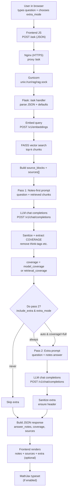

# RAG Notes Assistant (Backend)

Flask + Gunicorn backend for a **notes-first** RAG (Retrieval-Augmented Generation) assistant.

- **Pass 1 (notes-first):** retrieve relevant chunks from your course notes (FAISS) and answer primarily from those notes.
- **Pass 2 (optional extra):** add general context *without contradicting* the notes answer.

## What happens when the user clicks **Ask**

1. **User input (browser)**
   - The user enters a question.
   - The user selects `extra_mode` (`never`, `auto`, or `always`).

2. **Frontend sends request**
   - JavaScript sends `POST /ask` with JSON:
     - `question` (string)
     - `extra_mode` (string)
     - (optionally) `include_extra` (boolean, depending on UI)

3. **Nginx reverse proxy**
   - Nginx receives the HTTPS request on `/ask`.
   - It proxies the request to Gunicorn via the Unix socket `unix:/run/rag/rag.sock`.

4. **Gunicorn → Flask**
   - Gunicorn forwards the request to the Flask app.
   - Flask routes it to the `/ask` handler and parses the JSON payload (with defaults).

5. **Retrieve relevant note chunks (RAG retrieval)**
   - The backend calls the embeddings endpoint to embed the user question.
   - FAISS searches the vector index for the top-k most relevant chunks.
   - The backend prepares:
     - `sources[]` (metadata used for citations)
     - `source_blocks` (text snippets injected into the model prompt)

6. **Pass 1: Notes-first answer**
   - The backend calls the chat model with a prompt that prioritizes answering from the retrieved notes.
   - The raw model output is sanitized (e.g. remove `think` traces).
   - Coverage is computed:
     - Prefer `COVERAGE: full|partial|none` if the model provided it
     - Otherwise fall back to a retrieval-based heuristic

7. **Pass 2: Extra context (optional)**
   - If enabled by `extra_mode`:
     - `never`: skip pass 2
     - `always`: always run pass 2
     - `auto`: run pass 2 only if notes coverage is not `full`
   - Pass 2 adds general context without contradicting the notes answer.

8. **Backend returns JSON**
   - Flask returns JSON with:
     - `answer_notes`
     - `answer_extra` (or `null`)
     - `coverage`
     - `sources`

9. **Frontend renders response**
   - The UI displays the notes-based answer first (with citations).
   - If present, the UI shows the extra context section.
   - If MathJax is enabled, the page typesets LaTeX math in the rendered output.

---

## Request flow (Ask button)

---

## API

### POST /ask

Request JSON:

    {
      "question": "What is a partial derivative?",
      "extra_mode": "auto"
    }

- `extra_mode`: `"never"` | `"auto"` | `"always"`

Response JSON (shape):

    {
      "answer_notes": "…",
      "answer_extra": "… or null",
      "coverage": "full|partial|none",
      "sources": [
        {
          "tag": "[S1]",
          "source": "_includes/module2/m2_2.md",
          "chunk_id": 74,
          "score": 0.744
        }
      ]
    }

### GET /health

Returns:

    {"status":"ok"}

---

## Notes

- The FAISS index + metadata live under `vector_store/` (generated by the ingest pipeline).
- Typical deployment: **Nginx → Gunicorn (Unix socket) → Flask**.
