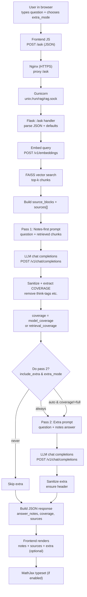

# RAG Notes Assistant (Backend)

Flask + Gunicorn backend for a **notes-first** RAG (Retrieval-Augmented Generation) assistant.

- **Pass 1 (notes-first):** retrieve relevant chunks from your course notes (FAISS) and answer primarily from those notes.
- **Pass 2 (optional extra):** add general context *without contradicting* the notes answer.

---

## Request flow (Ask button)

(Mermaid diagram below — wrap it in a mermaid fence in GitHub, see instructions right after.)

---

## API

### POST /ask

Request JSON:

    {
      "question": "What is a partial derivative?",
      "extra_mode": "auto"
    }

- `extra_mode`: `"never"` | `"auto"` | `"always"`

Response JSON (shape):

    {
      "answer_notes": "…",
      "answer_extra": "… or null",
      "coverage": "full|partial|none",
      "sources": [
        {
          "tag": "[S1]",
          "source": "_includes/module2/m2_2.md",
          "chunk_id": 74,
          "score": 0.744
        }
      ]
    }

### GET /health

Returns:

    {"status":"ok"}

---

## Notes

- The FAISS index + metadata live under `vector_store/` (generated by the ingest pipeline).
- Typical deployment: **Nginx → Gunicorn (Unix socket) → Flask**.
